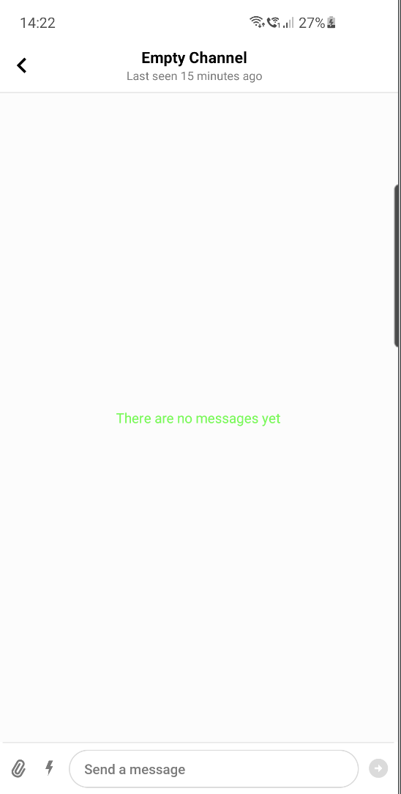
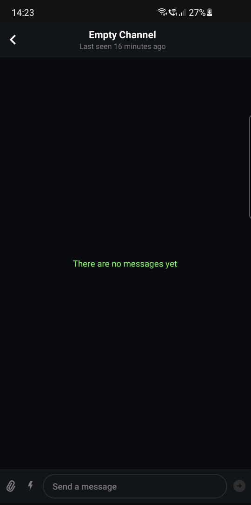

Let's slightly change the chat view by hiding the user avatar in the header and providing a custom empty state view.

| Light Mode | Dark Mode |
| --- | --- |
|||

We need to do following step to achieve that:
1. Modify _MessageListHeaderView_ layout:
```xml
    <io.getstream.chat.android.ui.message.list.header.MessageListHeaderView
        android:id="@+id/messagesHeaderView"
        android:layout_width="0dp"
        android:layout_height="wrap_content"
        app:layout_constraintEnd_toEndOf="parent"
        app:layout_constraintStart_toStartOf="parent"
        app:layout_constraintTop_toTopOf="parent"
        app:streamUiMessageListHeaderShowUserAvatar="false"
        />
```

2. Set new empty state view to _MessageListView_:
```kotlin
val textView = TextView(context).apply {
    text = "There are no messages yet"
    setTextColor(Color.GREEN)
}
messageListView.setEmptyStateView(
    view = textView,
    layoutParams = FrameLayout.LayoutParams(
        FrameLayout.LayoutParams.WRAP_CONTENT,
        FrameLayout.LayoutParams.WRAP_CONTENT,
        Gravity.CENTER
     )
)
```
